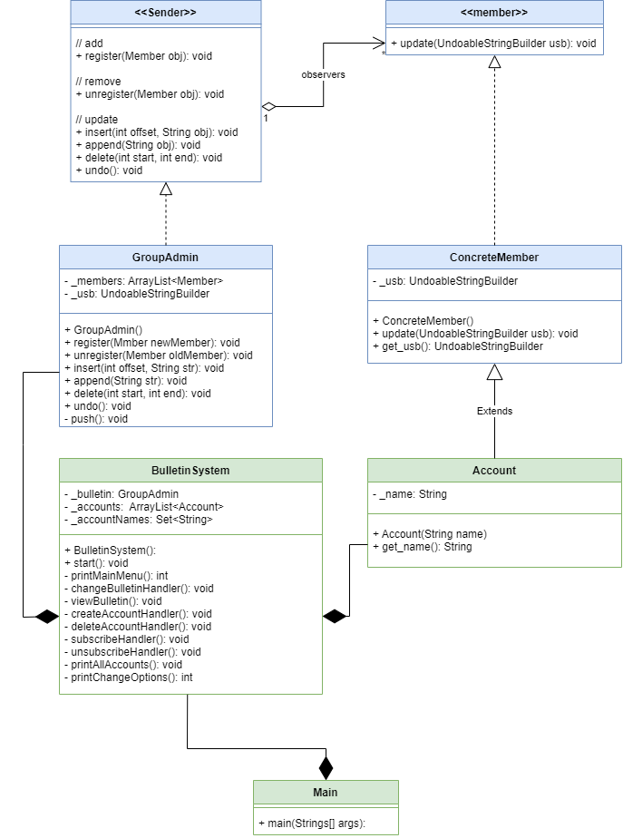

# Bulletin System
 <p align="center">

</p>


## Assignment 01

The mission is to extend the new functionality of UndoableStringBuilder from [Assignment_00](https://github.com/SariSafe/OOP_HW_00_ARIEL)


The new functionality gives us the option to hold a central UndoableStringBuilder object,

with user that notify when any change was created in the central UndoableStringBuilder.

All of that made by Design Pattern named OBSERVER.

 


For the Hebrew instruction [click here.](https://github.com/SariSafe/OOP.Assignment1/blob/master/Matala1.pdf)

There are tow links we used to understand the Observer Design Pattern:

- [Wikipidea](https://en.wikipedia.org/wiki/Observer_pattern)
- [YouTube](https://www.youtube.com/watch?v=_BpmfnqjgzQ)

## System Review
With this program you can preform the below:
1. Change Bulletin
2. View Bulletin
3. Create Account
4.  Delete Account
5.  Register the account
6. Unregister the account
7. Print all accounts
8. Exit

## UML:
- blue - is the Observer Design Pattern classes
- green - the class that belong to Bulletin System
 <p align="center">

</p>

## **Install & Run:**
````
git clone https://github.com/SariSafe/OOP.Assignment1.git
After clone need to open it by IDE and run the main... have fun !!!
````

## Languages and Tools

 <div align="center">
  <code></code>
 <code></code>
 <code></code>
  </div>


